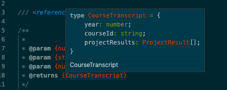
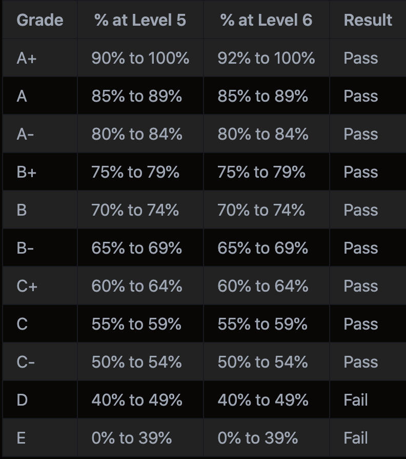

# 03 Project - absolute-unit 

<details>
  <summary>Marking Criteria</summary>
  <br />
  The following Learning Outcomes are assessed using the below criteria:

  <table>
    <tr>
      <td>LO32</td>
      <td>Implement hardware and software diagnostic testing,  maintenance, technical and customer support across a range of devices</td>
      <td>1 Credit<br />(3.33%)</td>
    </tr>
    <tr>
      <td>LO15</td>
      <td>Determine the performance of web applications using testing on multiple platforms, including a variety of devices and browsers; include integrity, speed, and considerations of user requirements.</td>
      <td>1 Credit<br />(3.33%)</td>
    </tr>
    <tr>
      <td>LO22</td>
      <td>Apply professional, legal, and ethical principles and practices in a socially responsible manner as an emerging IT professional.</td>
      <td>1 Credit<br />(3.33%)</td>
    </tr>
    <tr>
      <td>LO26</td>
      <td>Apply systems development life cycle principles including migrating changes through environments, and determine considerations for post-launch such as monitoring conversions</td>
      <td>1 Credit<br />(3.33%)</td>
    </tr>
    <tr>
      <td>LO29</td>
      <td>Review analytics and plan for change based on usage, feedback, environmental changes</td>
      <td>1 Credit<br />(3.33%)</td>
    </tr>
    <tr>
      <td>LO33</td>
      <td>Demonstrate advanced technical knowledge of applications for supporting user requirements.</td>
      <td>1 Credit<br />(3.33%)</td>
    </tr>
      <tr>
      <td>LO13</td>
      <td>Create and use a test plan that includes an overview of prototyping, utilises mock tools and tests with actual users and associated tools</td>
      <td>1 Credit<br />(3.33%)</td>
    </tr>
      <tr>
      <td>LO20</td>
      <td>Apply communication, collaboration, teamwork, documentation, customer experience and demonstrate projects using oral and visual presentations</td>
      <td>1 Credit<br />(3.33%)</td>
    </tr>
    <tr>
      <td colspan="2">
        Total credit weighting counting towards the final grade of WDD03
      </td>
      <td>
        8 Credits<br />(26.66%)
      </td>
    </tr>
  </table>

  To receive the LO credits - all summative projects must receive a C- Grade
  (50% or higher).

  <table>
    <tr>
      <th>Project Component</th>
      <th>Acceptance criteria</th>
      <th>Component weighting</th>
      <th>Assessment Grade</th>
    </tr>
    <tr>
      <td>Part A</td>
      <td>
        Meets the acceptance criteria for Part A. Automated tests pass. Feedback
        completed.
      </td>
      <td>25%</td>
      <td></td>
    </tr>
     <tr>
      <td>Part B</td>
      <td>
        Meets the acceptance criteria for Part B. Automated tests pass. Feedback
        completed.
      </td>
      <td>25%</td>
      <td></td>
    </tr>
     <tr>
      <td>Part C</td>
      <td>
        Meets the acceptance criteria for Part C. Automated tests pass. Feedback
        completed.
      </td>
      <td>25%</td>
      <td></td>
    </tr>
    <tr>
      <td>Code quality</td>
      <td>
        Code looks professional and is formatted in a consistent manner. Code is
        easy to read and understand, with comments and well named functions and
        variables. There is little to no repetition in logic. No
        errors/bugs/syntax problems.
      </td>
      <td>20%</td>
      <td></td>
    </tr>
    <tr>
      <td>Development process</td>
      <td>
        Submitted correctly in GitHub Classrooms. Includes at least one commit
        per project part, demonstrating progression of development. Clear commit
        messages.
      </td>
      <td>5%</td>
      <td></td>
    </tr>
    <tr>
      <th colspan="2" align="left">Total grade</th>
      <td>100%</td>
      <td>/100</td>
    </tr>
  </table>
</details>


## Brief

You have been selected to work on a top secret government grading system.
The system will calculate student grades using an advanced proprietary algorithm.
Some of your code depends on that of other employees.

## Rationale

We are normalising writing unit tests with every piece of code.
We have plenty of experiencing passing existing tests, and now we will write tests for existing code, and write both tests and code together.

We will leverage jest Mocks to break the dependency on external code.

At the same time we will reinforce manipulation of complex data structures using javascript, and learn the value of automated type checking.

## Pro Tip
This project involves complex types.  Use the JsDoc comments to help you, and run `npm run doc:serve` to generate a documentation webpage.
You can also hover over the typedef in jsDoc to view the type definitions.


This project also contains a `jsconfig.json` file to help you with squiggly lines and [intellisense](https://code.visualstudio.com/docs/introvideos/intellisense).  If it's not helping you can temporarily remove or rename it.

## Instructions Part A - `Unit Test existing code`
A recent code coverage report has determined a coverage hole in some recently committed code.  The Author checked it in last thing Friday and then went on holiday for 6 weeks.  It is based on [this logic](https://www.feesfree.govt.nz/eligibility-criteria/).
 The code seems to work fine - but as the logic may change or be refactored in future we should unit test it.

in `enrolment.test.js`, get the feesFree function exported from `enrolment.js` to 100% coverage.


## Instructions Part B - `Write Code and Tests Simultaneously based on business logic`
Some reporting systems call for a classical Letter grade.  As there are some subtleties around this calculation we should write some robust tested code.

This helper function is used in multiple places - to calculate grades for one assignment as well as the whole course.  For this reason it belongs in it's own module.

Implement this function in `gradeConverter.js` Make sure you have 100% test coverage in `gradeConverter.test.js` 




## Instructions Part C = `Mock External dependencies`
Now we want to report on our students' hard work with some transcripts.
A `CourseTranscript` contains several `ProjectResults`

With unit testing we clearly define one subject under test (SUT) 
We should mock everything else to see how the SUT behaves with known behaviours from its dependencies.  

Implement the `getCourseTranscript` function in `transcriptManger.js`, as well as corresponding tests.
It has a dependencies on the and `projectManager` module so you will need to mock/stub/spy this on your test..
For clarity these are in a folder named `dont-implement`. You do not need to implement these.

As defined in the jsDoc comments, the purpose of this function is to return grades for all projects for a particular student and course.  In your tests you will want to:
- ensure the `getProjectsForCourse` function was called with the correct arguments
- ensure the `getResultsForProject` function was called with correct arguments
- ensure a well formed transcript is returned.

--- 

# Submit your Project

- [ ] [Feedback](feedback.md) has been completed, and committed to git
- [ ] Commits are pushed to GitHub

---

<details>
  <summary>
    Git CLI Refresher
  </summary>

If you need help remembering what commands to type with `git`, use the following as a reference, or watch the [git walkthrough tutorial video](https://vimeo.com/433825571/bc1830fb90)

```shell
# when ready to commit and push
git add .

git commit -m "Completed Part A"

git push origin master
```

</details>
